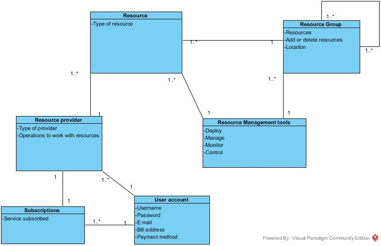

## Introduction to Requirements Engineering

In Software Engineering it is crucial to clearly understand which properties are required for a solution to solve the problem. These properties can be defined as software requirements. For that purpose, Requirements Engineering arises as the process of learning customer and user needs so as to arrive at a definition of a set of software requirements.

There are different types of requirements [[1]](http://enfocussolutions.com/business-user-and-system-requirements/):

* _Business requirements_ describe on a high-level basis why the organization/customer who requests the system is undertaking the project and what they expect to receive from it.
* _User requirements_, or user needs, describe what the user does with the system, namely what activities/tasks users must be able to perform.
* _System requirements_ are the requirements for the overall system given that it may include software and/or hardware components.
* _Software requirements_ derive from system requirements as they refer to particular and detailed requirements for a given software component that is part of the system.

Besides this differentiation, requirements can also be classified as either functional or nonfunctional requirements. Functional requirements refer to the functions or functionalities that the software is supposed to execute and present (what the system should do) while nonfunctional requirements can be seen as conditions and restrictions that should be imposed to the system (how the system should be). 

However, before starting to identify the requirements, it is important to first of all define the scope of the system. Scoping can be done by documenting the high-level system goals as terms of reference. This way, it is possible to focus the attention on which are the boundaries of the system [[2]](https://www.interaction-design.org/literature/book/the-encyclopedia-of-human-computer-interaction-2nd-ed/requirements-engineering). On the Azure SDK for Java project, the scope can be defined as providing the management of Azure services on Java applications.

Once the scope is determined, how can requirements be identified? Requirements elicitation includes interacting with everyone that is affected by the system (stakeholders) and analysing all the available sources. On this project, this is done mainly through direct customer interactions, for example phone calls and meetings, since they give a better understanding of the higher-level customer scenarios and pain points the APIs are intended to address. Also, in terms of business priorities, they follow their management's strategic guidance. Given the scope of the project, every time there is a new feature/service available in Azure, providing the management tools for that service immediately becomes a requirement [[3]]( https://github.com/Azure/azure-sdk-for-java/issues/1169). 

## Functional Requirements [[4]](https://azure.microsoft.com/pt-pt/blog/getting-started-with-the-azure-java-management-libraries/):

* Create, delete, and update settings for resources like web sites, SQL databases, cloud services, scheduler job collections, virtual machines, and storage.
* Start and stop web sites.
* Back up databases to storage accounts.
* Automate the creation of virtual machines.

## Non-Functional Requirements:

* Require Authentication: careless or malicious access to these APIs has the potential to break your applications and cost you money, so obviously these API calls need to be authenticated.ù [[5]](https://blogs.msdn.microsoft.com/tomholl/2014/11/24/unattended-authentication-to-azure-management-apis-with-azure-active-directory/)
* Provide different conditions to different types of Azure accounts: each account is usually associated with several features that are limited according to the price that was paid per month. For example, for the SQL Database the maximum storage capability is 250 GB per pool, which corresponds to the premium account; for the Machine Learning service, it can include up to 50000000 API transactions and 12500 API compute hours; and for the Virtual Machine service, there are several types that can be chosen (Linux, Windows, Ubuntu) [[6]](https://azure.microsoft.com/en-gb/pricing/calculator/).

## Domain Model
The Azure SDK for Java provides the tools to use Azure with software developed with JAVA. That way it will allow to manage some resources of the Azure platform that will be used in the software, like virtual machines, SQL databases or a storage account. Depending of the kind of resource that itís going to be used, it can be, if wanted by the developer, associated in groups of resources that will be managed all together. It allows an easy and simple way of managing, for instance control and monitor, the resources used in a specific part of the software. The resources of Azure can interact in the same project with some resource groups or with other resources. So this API provides all the resource management tools, for resource and resource groups, that a user may need when developing in JAVA [[7]](https://azure.microsoft.com/en-us/documentation/articles/resource-group-overview/).

The resources will be provided by a resource provider that will depend on the subscriptions that the developer has payed and has associated with his account. The domain model is the following:

